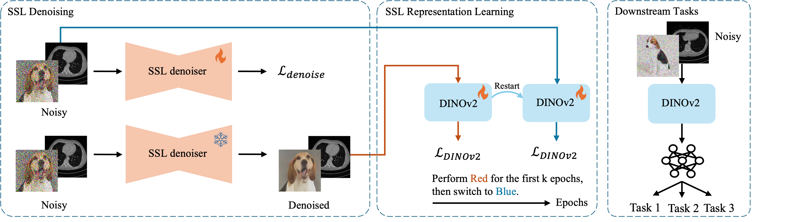
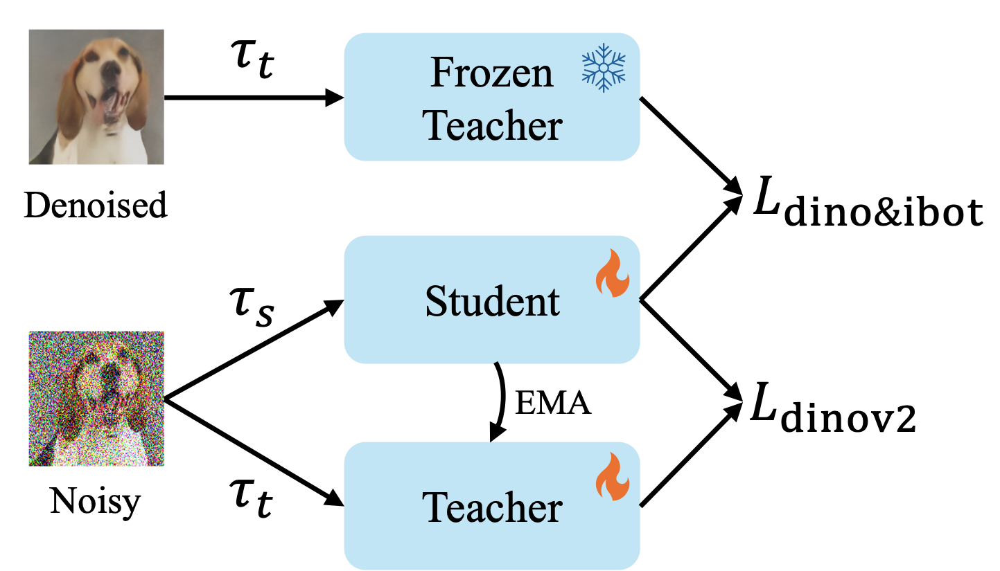

# Ditch the Denoiser: Emergence of Noise Robustness in Self-Supervised Learning from Data Curriculum

## Introduction
Self-Supervised Learning (SSL) has become a powerful solution to extract rich representations from unlabeled data. Yet, SSL research is mostly focused on clean, curated and high-quality datasets. As a result, applying SSL on noisy data remains a challenge, despite being crucial to applications such as astrophysics, medical imaging, geophysics or finance. In this work, we present a fully self-supervised framework that enables noise-robust representation learning without requiring a denoiser at inference or downstream fine-tuning. Our method first trains an SSL denoiser on noisy data, then uses it to construct a denoised-to-noisy data curriculum (i.e., training first on denoised, then noisy samples) for pretraining a SSL backbone (e.g., DINOv2), combined with a teacher-guided regularization that anchors noisy embeddings to their denoised counterparts. This process encourages the model to internalize noise robustness. Notably, the denoiser can be discarded after pretraining, simplifying deployment. On ImageNet-1k with ViT-B under extreme Gaussian noise ($\sigma=255$, SNR = 0.72 dB), our method improves linear probing accuracy by 4.8\% over DINOv2, demonstrating that denoiser-free robustness can emerge from noise-aware pretraining.

<figure>

<!--
-->
</figure>

## Get Started
Please follow [DINOv2](https://github.com/facebookresearch/dinov2) and [Neighbor2Neighbor](https://github.com/TaoHuang2018/Neighbor2Neighbor) to install all required packages and environments, which should be sufficient. We also provide our custom configurations in [conda-custom.yaml](conda-custom.yaml) and [n2n-conda-custom.yaml](imagenet-100-experiments/Neighbor2Neighbor/conda-custom.yaml).

We provide DINOv2 weights for our ImageNet-1k experiments (100 epochs, batch size 512)
| Model              | Gauss100                                         | Gauss255                                         |
|--------------------|--------------------------------------------------|--------------------------------------------------|
| DINOv2             | [Download](https://drive.google.com/file/d/1RyA5lzXWq8U1KzveTY437ezqqhRA4zC5/view?usp=sharing)                  | [Download](https://drive.google.com/file/d/1Pq1FTcVLc0jMPn8GLOwlddlzpuFhU37j/view?usp=sharing)                  |
| N2N + DINOv2       | [Download](https://drive.google.com/file/d/1nqRO8SeU8DUdOVy6WDunqNt7-nBtfsbc/view?usp=sharing)                  | [Download](https://drive.google.com/file/d/1MaCs7P8vEFSn5Ss5LbJiJR2Kz91pVjy2/view?usp=sharing)                  |
| DINOv2 w/ NC       | [Download](https://drive.google.com/file/d/179KTo_f7mb7-d5pMPKp8WgLOk2zj7gdw/view?usp=sharing)                  | [Download](https://drive.google.com/file/d/1hSad3Hiuz3pqCn6T3zV1PodrJNtpVwNY/view?usp=sharing)                  |
| DINOv2 w/ NCT      | [Download](https://drive.google.com/file/d/1lloJAXgHZXYcND0-GqLTRIVN3GZLwgjP/view?usp=sharing)                  | [Download](https://drive.google.com/file/d/1fq_FkK2Te_yxvt7ZSCPgRl94GhdZMX_A/view?usp=sharing)                  |

To evaluate DINOv2, DINOv2 w/ NC or DINOv2 w/ NCT on noisy validation set, first follow [imagenet-1k.md](imagenet-1k-experiments/imagenet-1k.md) to add noise, then run
```shell
cd imagenet-1k-experiments

PYTHONPATH="PATH_TO_imagenet-1k-experiments" python dinov2/run/eval/linear.py \
    --nodes 1 \
    --ngpus 4 \
    --batch-size 256 \
    --num-workers 6 \
    --epochs 20 \
    --pretrained-weights <WEIGHT_PATH> \
    --config-file dinov2/configs/<CONFIG>.yaml \
    --output-dir <OUT_DIR> \
    --train-dataset ImageNet:split=TRAIN:root=imagenet-gauss255:extra=imagenet-gauss255-extra \
    --val-dataset ImageNet:split=VAL:root=imagenet-gauss255:extra=imagenet-gauss255-extra

```

## MLP Toy Experiment on MNIST
Please refer to [toy_exp.md](toy_mnist/toy_exp.md) for running toy experiments.


## ImageNet-100 Experiments
Please refer to [imagenet-100.md](imagenet-100-experiments/imagenet-100.md) for running ImageNet-100 experiments.

## ImageNet-1k Experiments
Please refer to [imagenet-1k.md](imagenet-1k-experiments/imagenet-1k.md) for running ImageNet-1k experiments.


## Acknowledgement
Our codebase builds heavily on [DINOv2](https://github.com/facebookresearch/dinov2) and [Neighbor2Neighbor](https://github.com/TaoHuang2018/Neighbor2Neighbor).


If you find this repo helpful, please consider giving this repo a star :star:.
